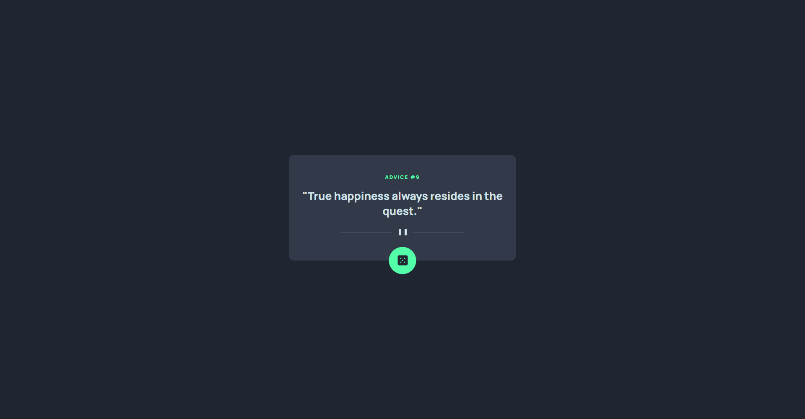
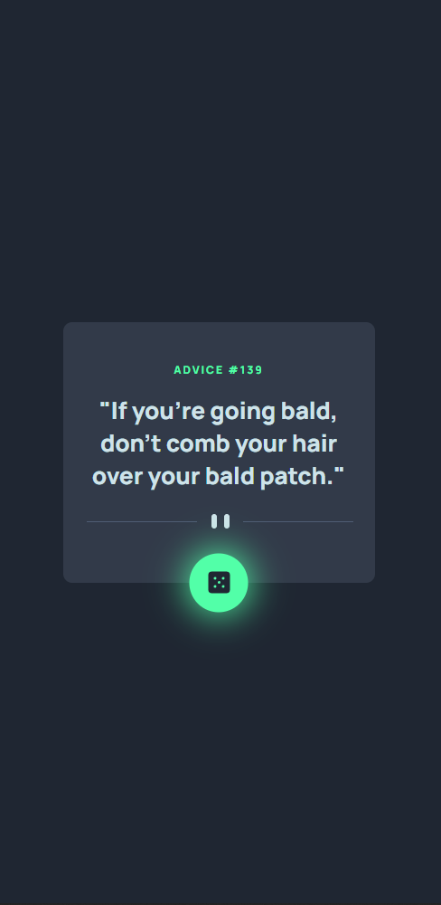

# Frontend Mentor - Advice generator app solution

This is a solution to the [Advice generator app challenge on Frontend Mentor](https://www.frontendmentor.io/challenges/advice-generator-app-QdUG-13db). Frontend Mentor challenges help you improve your coding skills by building realistic projects.

## Table of contents

- [Overview](#overview)
  - [The challenge](#the-challenge)
  - [Screenshot](#screenshot)
  - [Links](#links)
- [My process](#my-process)
  - [Built with](#built-with)
  - [What I learned](#what-i-learned)
  - [Continued development](#continued-development)
- [Author](#author)

## Overview

### The challenge

Users should be able to:

- View the optimal layout for the app depending on their device's screen size
- See hover states for all interactive elements on the page
- Generate a new piece of advice by clicking the dice icon

### Screenshot

Desktop:



Mobile:



### Links

- Solution URL: [Add solution URL here](https://your-solution-url.com)
- Live Site URL: [Add live site URL here](https://your-live-site-url.com)

## My process

### Built with

- JS Fetch API
- Semantic HTML5 markup
- CSS custom properties
- Mobile-first workflow

### What I learned

I learned more on how fetch works and what you can do with it. The code below worked well for me. The function is called when the window is finished loading via window.onload. It will create a quote upon first loading the page, then when the dice is clicked it changes the quote and id. I coded it like this so the fetch only had to be included once.

```js
function getData() {
    fetch ("https://api.adviceslip.com/advice")
      .then((response) => response.json())
      .then(function createAdviceObj(data) {
        if (id.innerText === "") {
          createAdvice(data);
        } else {
          newAdvice(data);
        }
      });
  };
```

### Continued development

I want to continue focusing on writing cleaner code. I feel like I still need to declare a lot of variables and write long code.

## Author

- Website - [MarkVanweersch.GitHub.io](https://markvanweersch.github.io/)
- Frontend Mentor - [@MarkVanweersch](https://www.frontendmentor.io/profile/MarkVanweersch)